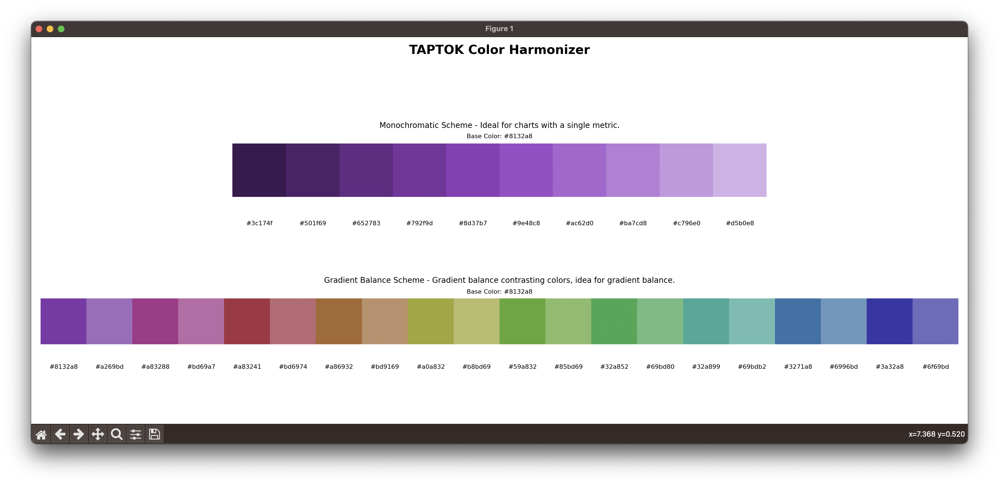
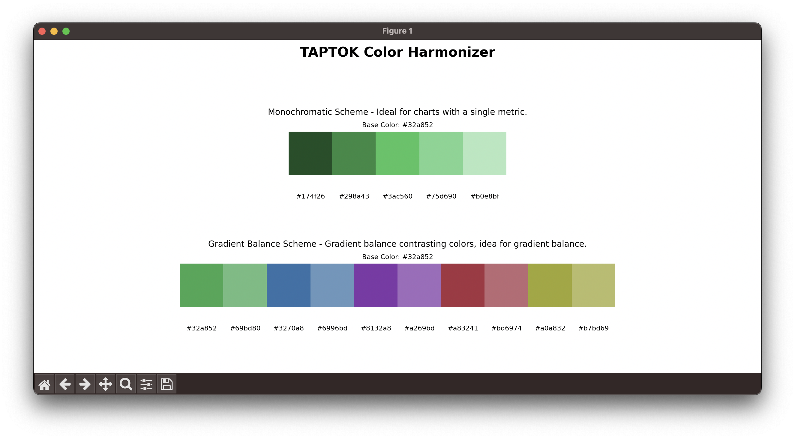
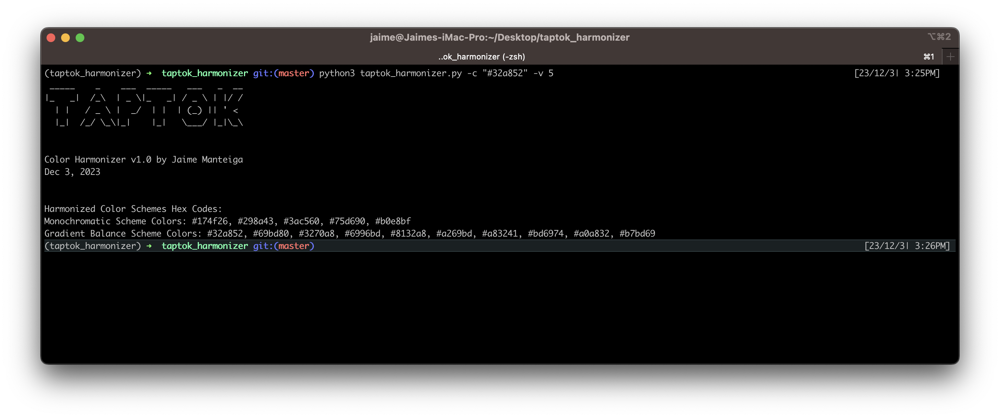

# TAPTOK Color Harmonizer

## Introduction
TAPTOK Color Harmonizer is a Python script designed to assist in selecting harmonious and appealing color schemes for UI design, particularly for charts and visual elements. It generates color schemes based on a provided base color, helping designers and developers create cohesive and visually engaging interfaces.

## Features
- Generates two main color schemes: Monochromatic and Gradient Balance.
- Helps visualize how different color variations harmonize with a chosen base color.
- Useful for designing UI elements, charts, and gradients.

## Installation

### Requirements
- Python 3.x
- Matplotlib
- Colormath
- Art

### Setup
1. Clone the repository or download the script.
2. Install required dependencies:

`pip install -r requirements.txt`

## Usage

Run the script from the command line with the desired color (in hex format) and the number of variations:

`python taptok_harmonizer.py -c "#32a852" -v 5`

### Parameters
- `-c` or `--color`: Base color in hex format (e.g., `#32a852`).
- `-v` or `--variations`: Number of color variations to generate (default: 4).

## Color Schemes

### Monochromatic Scheme
Generates varying shades of the base color. Ideal for creating a minimalistic and unified aesthetic in UI designs.

### Gradient Balance Scheme
Produces a pair of colors harmonizing with the base color. These pairs are perfect for crafting visually pleasing gradients in UI elements.

## License
This project is open source and available under the [MIT License](LICENSE).

## Version
Current version: 1.0
